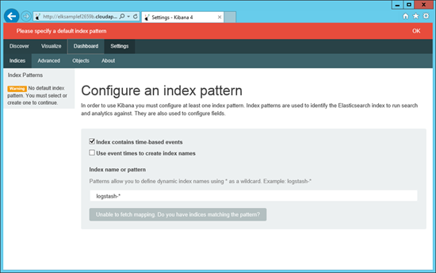

# Setting up ELK to Consume From Application Insights
In this setup we will detail the steps you need to take to consume blobs created by Application Insights.
Before your continue with the setup you will need to complete the [installation requirements](/md/SetupInstructions.md) for running this script.
Also you will need to have a service using Application Insights and configured it to export its data to blob storage.

## Logstash config file
1. Run New-SampleLogstashConfigWithStorage.ps1 with the name of the storage account and container where the Application Insights data located
    ```
    .\New-SampleLogstashConfigWithStorage.ps1 -StorageAccountName "<Your storage account name>" -ContainerName "<Your container name>"
    ```
## Creating the ELK VM
2. Run the follow command to start the ELK VM creation. Please choose your own user name, password, and location that's suitable for you.
    ```
    .\New-SampleELKInstance.ps1 -Location "West US" -Username "elk" -Password "Elk1234" -LogstashConfig "logstash.conf" -UseKibana4
    ```
3. Wait for the script to complete. This  will take about 10 to 20 min. Along with the ELK VM, it will also create a new cloud service and storage account for you. Once it's done, it should show you the name of the cloud service after the text "To see your kibana dashboard visit". Verify your setup by launching the browser and navigating to http://yourcloudservice.cloudapp.net to see the default Kibana page. Note that it may take up to 5 minutes until Logstash is properly initialized and starts populating ElasticSearch.  

