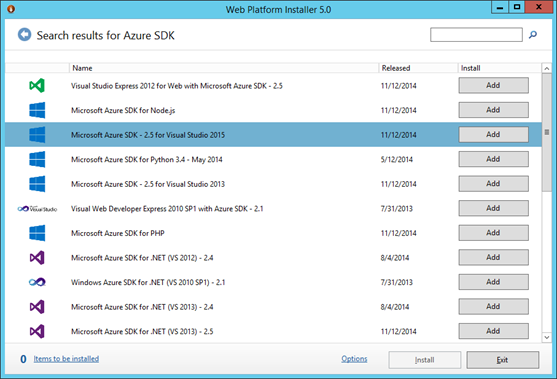
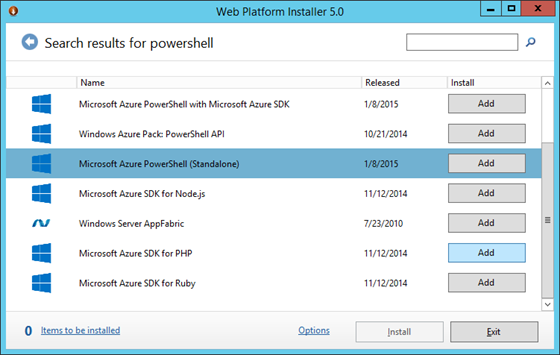
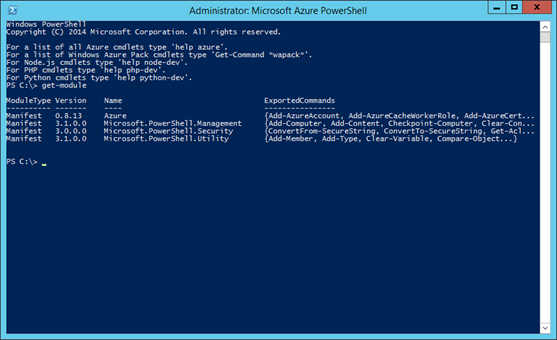

# Setting up the environment

## Installation
1. Install Visual Studio 2013
2. Launch Web Platform Installer and install Microsoft Azure SDK for Visual Studio 2015   
 
3. Install Microsoft Azure Powershell  

4. Launch Microsoft Azure Powershell and type "Get-Module" and see if the Azure module is imported. If not, try rebooting and then check again. In certain cases after powershell installation, the powershell module path is not updated properly and requires a reboot.    

5. Install msysgit from [here]( https://github.com/msysgit/msysgit/releases/). On the site, choose the a stable version of msysGit-netinstall exe and install the tools

## Environment Variables
6. Add the required environment variables. These environment variables allow the ELK setup scripts to locate the required tools. If you want to add them just to your session of powershell, skip this step for now.  
If you want to add them globally so they apply to all new processes, add these to the PATH variable. Go to **control panel->System and Security->System**, open Advanced system settings, then click on Environment Variables, add
    ```
    "<Installed location of msysgit>\bin"
    ```
for the PATH variable.
Since locations of these tools can change from version to version, check the path for the following tools and add their paths as well 
>ssh: to run commands on the remote machine  
>scp: to copy files onto the remote machine  
>openssl: to generate certificates for ssh connection  
>sed: to edit of the configuration files deployed to the remote machines

## Setting up the proper powershell environment
1. Launch the Windows Azure Powershell in administrator mode
2. Change the execution policy to bypass. This will stop powershell prompting you for confirmation about running the scripts.
    ```
    Set-ExecutionPolicy bypass -Scope Process
    ```
3. If you didn’t add the environment variables in step 5 of "Setting up the environment", follow that step to determine all the paths you need and add them as such:
    ```
    $ENV:PATH="$ENV:PATH;<Installed location of msysgit>\bin;<any other paths needed>"
    ```
4. Add an environment variable for openssl config file
    ```
    $ENV:OPENSSL_CONF ="<Installed location of msysgit>\ssl\openssl.cnf"
    ```
5. If your powershell is not associated with an account yet, run Add-AzureAccount.	This will pop up a sign in dialog.
6. Run Get-AzureSubscription to see your list of subscriptions. Pick the one you want to use and run
    ```
    Select-AzureSubscription -subscriptionid <your subscription id>
    ```
7. Run Get-AzureSubscription again and check that its IsCurrent field is marked as true
8. Change to the directory where all the PowerShell Scripts are located, so it's ready for next set of configuration steps 
9. Do not close this powershell window until you are fully setup