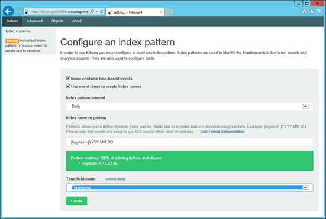
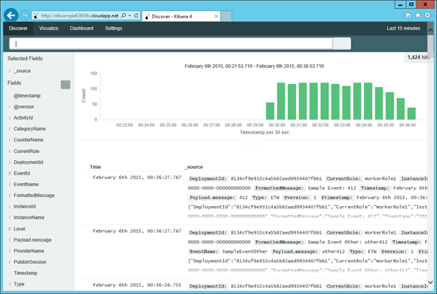

# Verifying data on Kibana
1. Once the cloud service is deployed, refresh your browser on the kibana dashboard. Check the "User event times to create index names" checkbox, it should use the logstash timestamp pattern to match and find some indices. Select Timestamp as the Time-field name and click Create      

2. Click Discover at the top, and you should start seeing data  

3. Your ELK stack is now up and running.  
